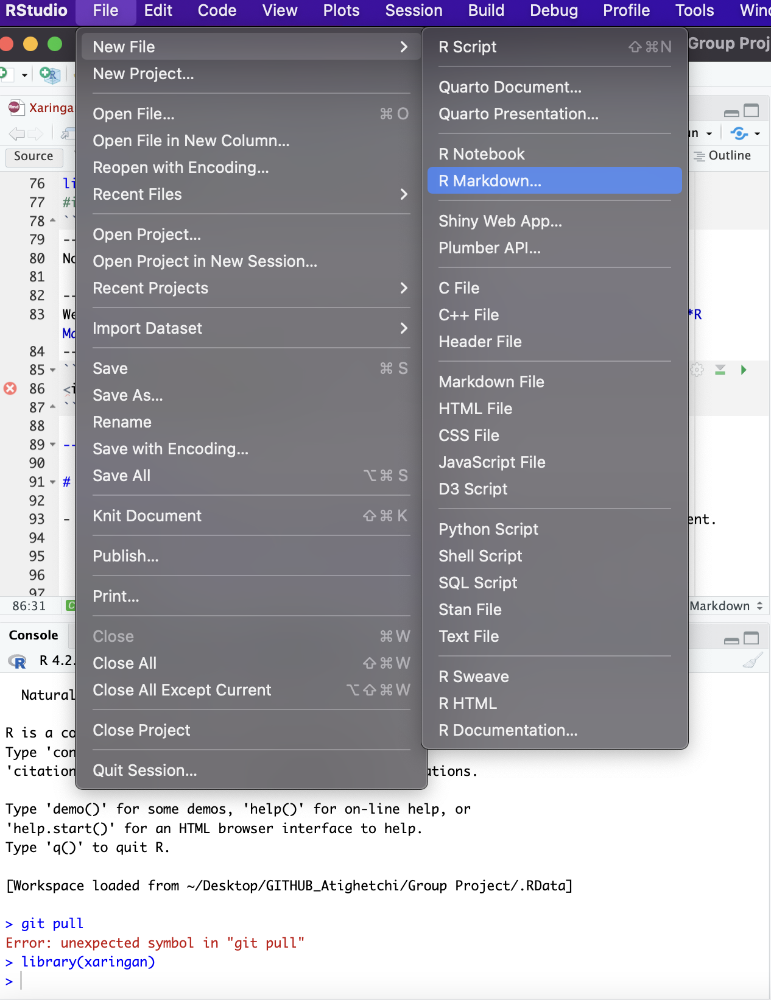
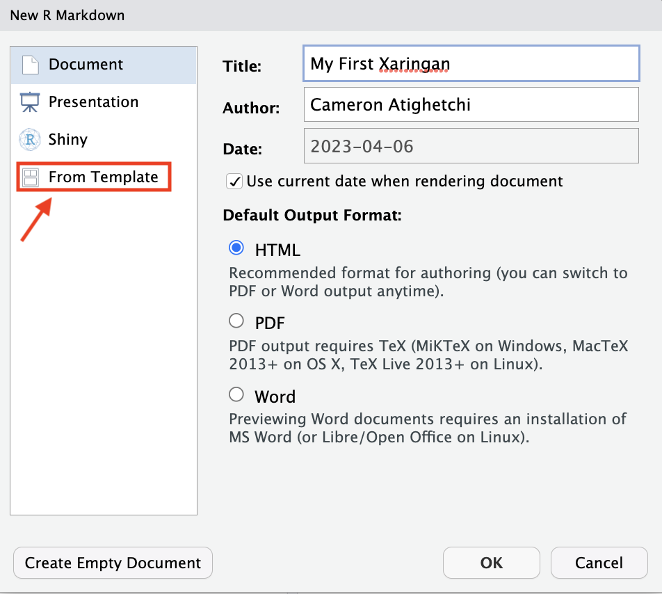
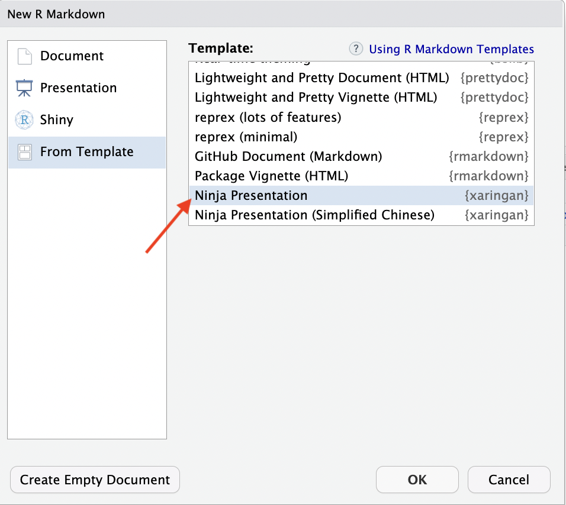

# What is Xaringan?  

Xaringan is an R package used to create HTML presentations using Rmarkdown interfaces.  

Slides created by Xaringan are rendered by remark.js (an HTML JavaScript presentation program) and converted to an HTML form from R markdown.  

An understanding of **remark.js** is a good place to start!!


---

.left-column[<span style="font-size: 40px;">Basics of remark.js</span>]

.right-column[ 
1. Markdown-driven slideshow tool
1. Regular Markdown rules apply with only a single exception:
   - A line containing **three dashes** constitutes a new slide (---)
2. remark.js does not support R, only Markdown
3. Markdown-formatted chunk of text is transformed into individual slides by JavaScript running in the browser
4. remark.js can be thought of as a precursor to xaringan - xaringan understands R ]

---

.left-column[<span style="font-size: 40px;">Basics of Xaringan</span>]

.right-column[
1. R Markdown extension that uses remark.js to generate HTML slides
1. The name originates from Naruto
2. Very customizable and has multiple uses including theme customization and more
1. Some features include:
   - Autoplay
   - Countdown
   - Highlighting Code
]
.right-column[
```{r,eval=FALSE,message=FALSE, warning=FALSE}
# THIS IS WHAT A YAML AND INTRO SLIDE LOOK LIKE IN XARINGAN
title: "Penguin Presentation"
subtitle: "⚔️<br/>"
author: "Your name"
date: "`r Sys.Date()`"
output:
  xaringan::moon_reader:
---
# Get Started
```
]
---
# Let's Get Started with Xaringan

Everyone should go ahead and install xaringan using:

```{r,eval=FALSE,message=FALSE, warning=FALSE}
install.packages("xaringan")   #<< 
library(xaringan)
#install and run xaringan straight from R packages
```
--
Now...  

--
We can open a new R Markdown document by going to **File** <- **New File** <- **R Markdown**  

--
<p align="center">

</p>
---
# YAML Text: Xaringan Setup

Now name your document something useful: Such as "My first Xaringan Presentation"

We then want to select **"From Template"**  

--
<p align="center">

</p>  
--
Then we want to scroll down and select "Ninja Presentation" from our template menu
--
<p align="center">

</p>
---
# YAML Text: Xaringan Setup

Now delete everything that isn't the YAML text the bottom of the YAML text should look like this:

```{r,eval=FALSE,message=FALSE, warning=FALSE}
# THIS IS WHAT A YAML AND INTRO SLIDE LOOK LIKE IN XARINGAN
title: "Penguin Presentation"
subtitle: "⚔️<br/>"
author: "Your name"
date: "`r Sys.Date()`"
output:
  xaringan::moon_reader:
---
# Get Started

Hi !!!!!!}

```

Now we have the base of Xaringan Presentation!!!!
---

# How do we separate slides?  

- Using three dashes (---) directly in our R markdown document we can separate slides

--

- These three dashes should be on their own line after the last text or code we want to put in that slide
- Example:
```{r eval=FALSE}
--- #<<
  # Slide 1 
  
  Text, text, text, text, code
--- #<<
  # Slide 2 
  
  Text, text, text, text, list, code
--- #<<
```

---

# Adding R code

- Adding a R code chunk to the presentation is the same as in a RMarkdown document.

--

  - Using **Ctrl+Alt+I** _(for both windows and mac)_ still works 
  
--
  
  - Example:
.pull-center[
```{r, message=FALSE}
library(tidyverse)
library(here)
library(palmerpenguins)
```
]  

---
  
# Higlighting Code
- You can highlight code by using '{{}}' or '#<<':

--

- I tend to like using the "#<<" after my code to highlight it

--

  - Example:
  
```{r}
{{Chem_Data <- read.csv(here("Xaringan Project", "Data", "chemicaldata_maunalua.csv"))}}
# Highlights the area you surround with the {{}}
```
```{r, echo=FALSE}
Clean_Chem_Data <- Chem_Data %>%
  drop_na()
```

--
- _You can also use a leading asterisk but it is harder to use compared to the brackets_
---
# Adding Images to a Xaringan Slide

- Adding images to a xaringan slide is a relatively easy process

--

- It is the same as adding images to a R Markdown document with a few extra steps

--

> You can input the position of these images using a content class (ex: .center)

--

```{r eval=FALSE}
# Adding Local images - these images should be in the same folder as the project
.center[] # input path to the image

# Adding images from the web - add the URL
.center[)+  # Bases the colors off of the Zone they were in
  geom_point(size = 2.5)+  # makes a basic point plot and changes the size of the points
  geom_smooth(method = lm)+ # Adds lines to the plot
  theme_bw()+   # Uses a black and white theme
  scale_color_viridis_d()+  # Color blind friendly color palette
  facet_wrap(~Zone)#]       #<<  # Facets the plot based on Zone
# Just a basic plot to illustrate how adding a plot to the slides works
# Only shows the code and not the plot itself
```
]


```{r, echo=FALSE, message=FALSE}
ggsave(here("Xaringan Project", "Output", "Example Plot.png"))
# Saves the image
```


.pull-right[
```{r exampleplot-out, ref.label="exampleplot", echo=FALSE, message=FALSE, warning=FALSE}
# Adds the image of the plot to the slides.
```

]
---

# Adding a plot

- To make the code chunk and plot separate, you need to use:

--

  - Two separate R code chunks
  
      - One contains the code for the plot but add **eval = FALSE** to the {r} section to keep the plot from showing.
    
      - The other is a R code chunk that uses the name given to the plot code chunk but instead adds _-out_ to the end.
    
          - Add **ref.label="plot name"** to show the plot.

--
      
- You can then use **pull-left[]**, **pull-right[]**, and **pull-center[]** around the code chunks to move them on the slide.

--

  - _When using these functions makes sure to put a "." in front of them_
---

# Adding a Table

- You are able to add a kable table to the presentation

--

  - _Make sure it is in HTML format or it will not work_
  
--
  
  - Example:
  
```{r}
knitr::kable(head(Chem_Data[, 1:5]), format = 'html')
# Adds a table to the slide
```
---

# Autoplay

- You can enable _autoplay_ by adding to the **nature** section of the YAML at the beginning of the presentation.

--


```{r, eval = FALSE}
output:
  xaringan::moon_reader:
    nature:
   {{autoplay: 50000}}
# This makes iot so the slides change automatically at a specific time
```

--

- To make the presentation loop after it ends, add the sub-option called _loop_ to **TRUE**

--

```{r, eval = FALSE}
output:
  xaringan::moon_reader:
    nature:
      autoplay:
        interval: 50000
        loop: true   #<< 
# Loops the presentation after it is over
```

---
# Slide Layout

- Using something called **content classes** we can assign classes to elements that can alter the display of our slides!!

--

- Examples include:
```{r eval=FALSE}
#.pull-left["element"] or .pull-right["element"] where our element can be 
# an image, text, or a list

.pull-left[ 
- Bullet point

- Another bullet point
]

.pull-right[

]

.center []

.right-column[] 
```


---
# Macros

- Change the size of pictures
  - use code: ``

--
 


---
# Presenter Notes

- Presenter can create notes within the script that won't be shown in slides!

--

- To create hidden slides, all you need is to type "???" after the text you want to be shown and before the notes you want to create.

--

- To view these notes just click [p] in the presenter view, you will have to check settings to not mirror displays

--

For Example:
```{r eval = FALSE}
???
you cant see me :-:
  
# this will hide text written below the question marks 
```

---
# Yolo - TRUE

- You must be wondering why there is a random picture of some guy with a mustache, this is a YAML option that comes standard in the xaringan package 

--

- This option will randomly insert a picture of Karl Broman into your slides 

```{r eval=FALSE}
---
output:
  xaringan::moon_reader:
    yolo: true #<<
---
# you can also use yolo:true to add other pictures
  
---
output:
  xaringan::moon_reader:
    yolo:
      img: image.png # image #<<
      times: 5 # how many times do you want this to show up randomly #<<
---
  
```

---
# Incremental Slides

- Another essential aspect to Xaringan is the use of Incremental slides, which has been used throughout this presentation  

--

- The use of incremental slides is similar to that of a "click in" animation in powerpoint and will show text incrementally and is done by using a double dash (--)

--
- We can use incremental slides within our slide separations (---), make sure to **click return or "enter"** before placing a double dash to assign the next text to a different line

- Example:

```{r eval=FALSE}
--- 
  # Slide 1
  
  Text I want to show first

-- #<<
  Text I want to show second

-- #<<
  Text I want to show third

---
```
---
#Disadvantages of Xaringan

- A good understanding of CSS is needed to navigate the many themes and customization it takes to really change the Xaringan package into what you want it to look like

> You can keep the 'ninja' theme if you don't really want to change anything
  
- The output file can sometimes be challenging to work with so you should always output it to the browser since some images and other renderings might not show

- HTML widgets may also not work well with Xaringan

.center[]
---

# Now it's your turn!

- It's your turn to create your **first Xaringan Presentation!**

---
# Create a title page

- Let's make a title page

--

- Type in the following script: 
```{r eval= FALSE}
---
title: "Penguin Presentation"
subtitle: "⚔<br/>"
author: "Your name"
date: "`r Sys.Date()`"
output:
  xaringan::moon_reader:   # This is the basic Xaringan YAML that comes standard with the package
    yolo: true
    css: [default, metropolis, metropolis-fonts]
    # Changes the theme of Xaringan through a CSS theme.
    lib_dir: libs  # This creates a CSS folder that includes the themes we want for the directory
    nature: 
      highlightStyle: github
      highlightLines: true
      # This changes the style of highlights in our code chunks
      countIncrementalSlides: false # Doesn't count incremental slides as their own slides
---    
```
---
# Required Libraries

- Go ahead and add a code chunk and load these libraries:

```{r, eval=FALSE}
library(tidyverse)
library(here)
library(palmerpenguins)
```

---

# Let's add a basic plot

- Create a basic plot using the penguins data set

```{r penguinplot, message=FALSE, warning=FALSE}
ggplot(data = penguins, aes(x = bill_length_mm,    # The values that I want to plot
                            y = flipper_length_mm,
                            color = species))+ # Will base color off of species
  geom_point()+   # Makes a basic point plot
  theme_bw()+    # Uses the black and white theme
  geom_smooth(method = "lm")+  # Adds lines to the plot
  scale_color_viridis_d()  # Color-blind friendly palette
```

```{r echo=TRUE, message=FALSE}
ggsave(here("Xaringan Project", "Output", "Interactive_Plot.png"))
# Saves the plot
```

---
# Let's clean it up a bit

- Add a name in the code chunk for your plot

--

- Use the content class below around your code chunk to pull it to the left. 
```{r eval=FALSE}
.pull-left[code chunk]   # Pulls code chunk to the left
```

--

- Add **eval = FALSE** to the {r} bracket so it won't show the plot.

---
# Let's clean it up a bit

- Now add a code chunk below your plot's code chunk that includes what's below in the {r} bracket:

```{r eval=FALSE}
{r penguinplot-out, ref.label="penguinplot", echo=FALSE, message=FALSE, warning=FALSE}  # Allows you to have your plot on the page without the code being attached
```

--

- Go ahead and add the content class to pull the plot to the right and add it around the code chunk.

---

# Now it should look like this!

.pull-left[
```{r penguinplot1, message=FALSE, warning=FALSE, eval=FALSE}
ggplot(data = penguins, aes(x = bill_length_mm,    # The values that I want to plot
                            y = flipper_length_mm,
                            color = species))+ # Will base color off of species
  geom_point()+   # Makes a basic point plot
  theme_bw()+    # Uses the black and white theme
  geom_smooth(method = "lm")+  # Adds lines to the plot
  scale_color_viridis_d()  # Color blind friendly palette
```
]

.pull-right[
```{r penguinplot1-out, ref.label="penguinplot", echo=FALSE, message=FALSE, warning=FALSE}

```
]
---
# Think, Pair, Share

- Now it's time to think, pair, and share!!

- Create an **incremental slide**, with any picture, a chunk of code with highlights and an output using the penguins dataset

--

- An example could look like this:

```{r warning=FALSE, fig.width=6, fig.height=3, fig.align='center'}
penguins %>%   # The data frame
  ggplot(aes(x = bill_depth_mm,  # The values that we want plotted for x and y
             y = flipper_length_mm)) +
  facet_grid(~island) + #<<     # facets the plot according to which island
  geom_point()  # Makes a basic point plot
```

```{r message=FALSE, echo=FALSE}
ggsave(here("Xaringan Project", "Output", "Think_Pair_Share.png"))
# Saves the plot
```


---
#THANK YOU!!

## Thank you for listening and we hope Xaringan is something you end up using!


---

# Peaches

.pull-left[ ]

.pull-center[]

.pull-right[]

https://www.youtube.com/watch?v=aW7bzd8uwyQ


